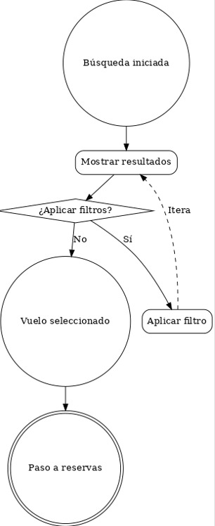

# Squad 3 - Búsqueda de Vuelos

Sistema de búsqueda de vuelos desarrollado por Squad 3.

## Estructura del Proyecto

```
squad-3-busqueda-de-vuelos/
├── front/          # Frontend React + Vite
├── back/           # Backend Node.js (futuro)
└── package.json    # Workspace principal
```


## Comandos Disponibles

### Desde el directorio raíz:

- `npm run dev` - Ejecuta el frontend en modo desarrollo
- `npm run dev:front` - Ejecuta solo el frontend
- `npm run dev:back` - Ejecuta solo el backend (cuando esté implementado)
- `npm run build` - Construye el frontend para producción
- `npm run lint` - Ejecuta el linter del frontend
- `npm run install:all` - Instala todas las dependencias

### Desde el directorio front/:

- `npm run dev` - Ejecuta Vite en modo desarrollo
- `npm run build` - Construye para producción
- `npm run preview` - Vista previa de la build
- `npm run lint` - Ejecuta ESLint

## Instalación

1. Clona el repositorio
2. Ejecuta `npm run install:all` desde el directorio raíz
3. Ejecuta `npm run dev` para iniciar el frontend

## Tecnologías

- **Frontend**: React + Vite + Material-UI
- **Backend**: Node.js + Express (futuro)
- **Gestión de paquetes**: npm workspaces

## Diagrama de flujo del proceso de búsqueda y selección de vuelo



## Trello + sprints tareas
<a>https://trello.com/b/XPvm4Yif/squad3reservavuelos</a>

## Documentacion del TPO +endpoints + requerimientos desde otros equipos:
<a>https://docs.google.com/document/d/1V8aasdXoWq9PEpiYb9Inc2g9NWTr5xsz5o1uAQWQ-iI/edit?tab=t.0</a>